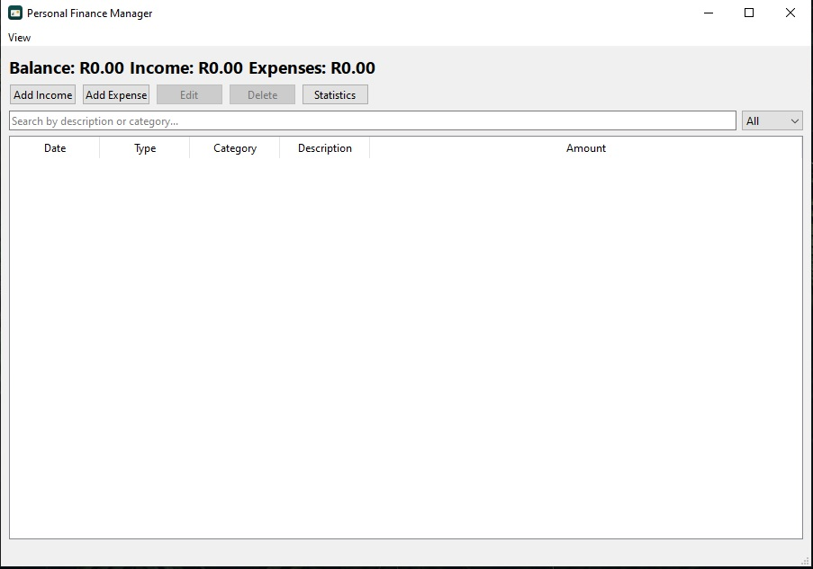
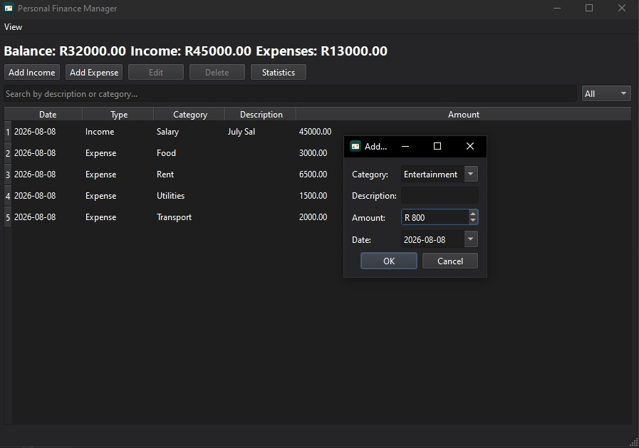
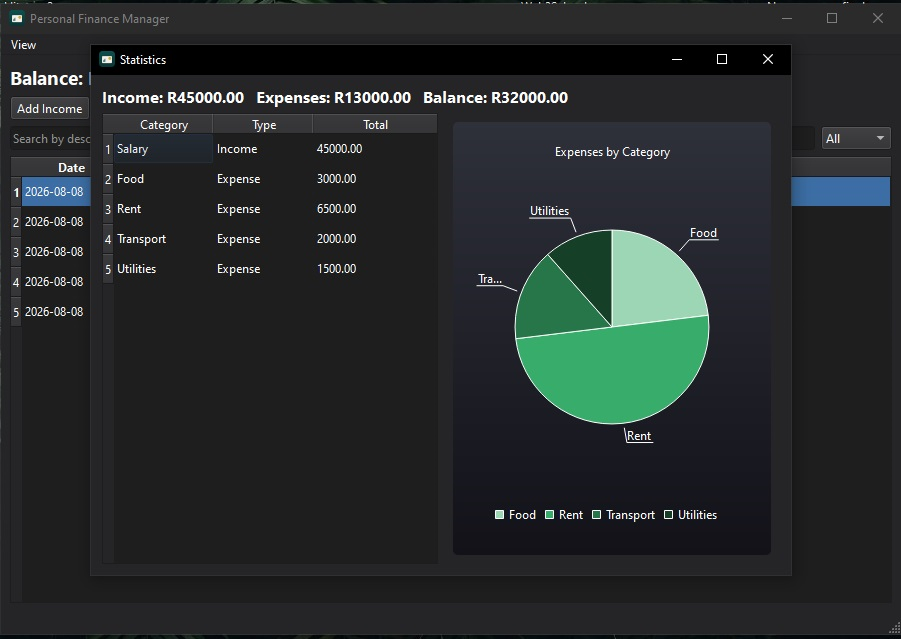
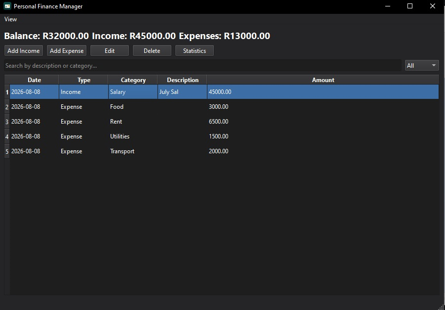

# Personal Finance Manager

A desktop personal finance app built in C++ with Qt Widgets. Track income and expenses, search and filter transactions, edit or delete records, and see a breakdown of where your money's going, all stored locally, no accounts or servers involved.

Built as a portfolio project to get hands-on with modern C++, object-oriented design, GUI development, and a proper Git workflow.



## Features

- **Dashboard** — running balance, total income, and total expenses at a glance
- **Add income / add expense** — quick-entry dialogs with category, description, amount, and date
- **Transaction history** — a sortable table of everything you've logged
- **Edit & delete** — update or remove any transaction, with a confirmation prompt before deleting
- **Search & filter** — search by description or category, filter by income/expense
- **Statistics** — category breakdown table plus a pie chart of expenses by category
- **Local storage** — everything saves automatically to a JSON file on disk, and reloads on the next launch
- **Custom app icon** — because it should look like a real app, not a random `.exe`

## Tech Stack

- **C++17**
- **Qt 6** (Widgets + Charts)
- **CMake** for the build
- **JSON** for local data storage (via Qt's `QJsonDocument`)
- **Git / GitHub** for version control

## Architecture

```
include/            Header files
  Transaction.h        Data model for a single income/expense record
  FinanceManager.h      Business logic: totals, search, filtering, CRUD
  FileManager.h          Save/load transactions to/from JSON
  TransactionDialog.h  Add/edit dialog, shared between income and expense
  StatisticsDialog.h    Category breakdown + expense pie chart
  MainWindow.h            Main application window

src/                Implementation files (mirrors include/)

resources/          App icon assets (.ico, .png, .qrc)
data/               transactions.json lives here at runtime (gitignored, it's your data, not project code)
screenshots/        App screenshots for this README
```

The split follows a simple separation of concerns: `Transaction` is a plain data model, `FinanceManager` owns the in-memory list and all the logic around it (totals, search, filtering), `FileManager` handles reading and writing that list to disk, and `MainWindow` just wires the UI to `FinanceManager` and reacts to what the user does.

## Building

**Requirements:**
- Qt 6 (Widgets and Charts modules)
- CMake 3.16+
- A C++17-capable compiler (MSVC, MinGW, GCC, or Clang)

**Steps:**

1. Clone the repo
2. Open the folder in Qt Creator via `CMakeLists.txt`, or configure manually:
   ```
   cmake -B build -S .
   cmake --build build
   ```
3. Run the resulting `PersonalFinanceManager` executable

> Qt Charts isn't included in a default Qt install. If CMake can't find it, open the Qt Maintenance Tool and enable the Charts component for your Qt version.

## Data

Transactions are stored in `data/transactions.json`, created automatically on first save. It's excluded from version control since it's personal data, not part of the codebase, so a fresh clone starts with an empty ledger.

## Roadmap

- [x] Transaction model, dashboard, add income/expense
- [x] FinanceManager, transaction history table
- [x] Edit, delete, search, filter
- [x] JSON persistence, statistics, expense chart
- [x] App icon
- [ ] Dark mode

## Screenshots

**Dashboard**


**Add Expense**


**Statistics**


**Dark Mode**

## License

This project is available for personal and educational use. Feel free to fork it and adapt it for your own portfolio.
